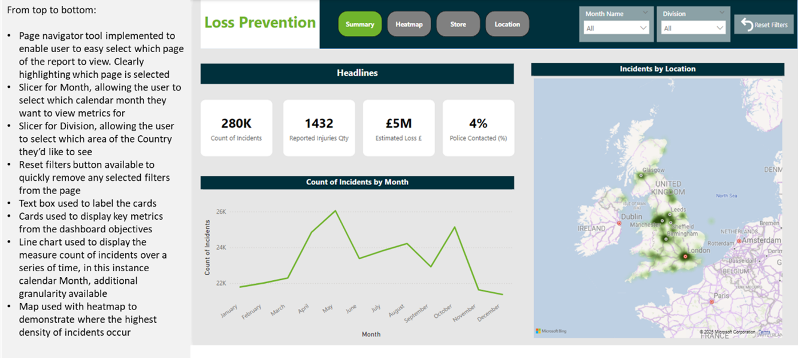
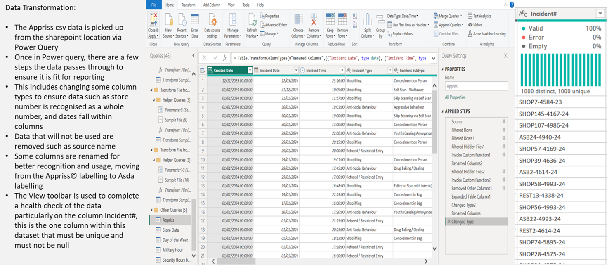
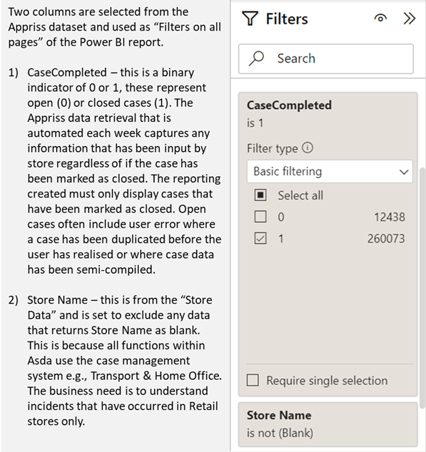
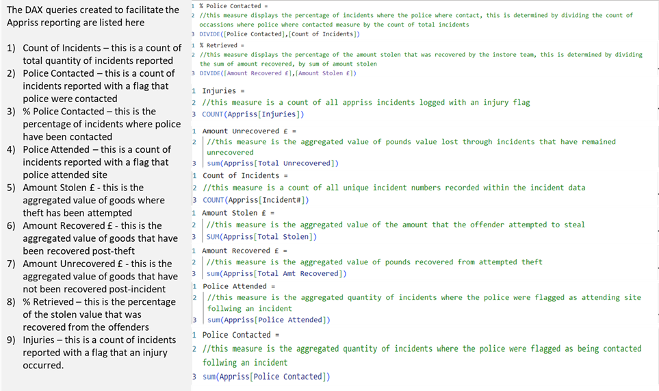
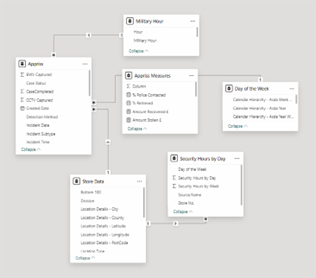
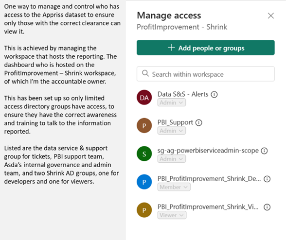
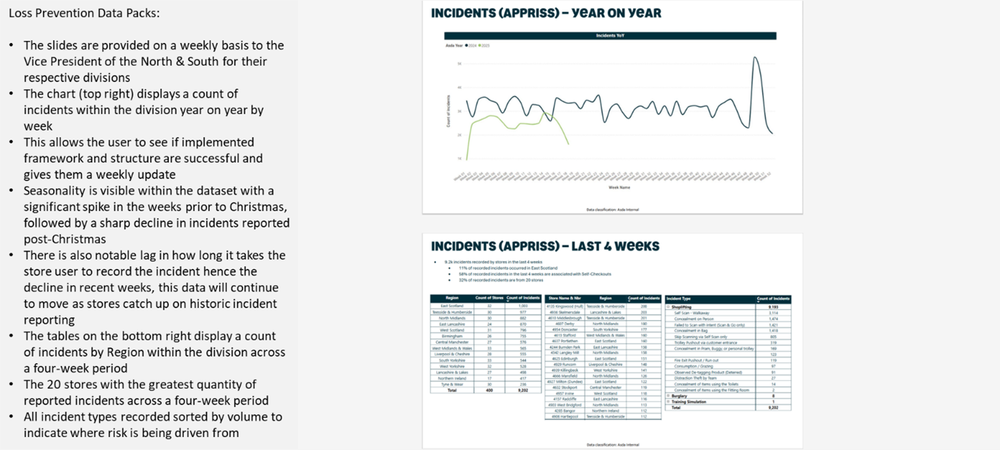
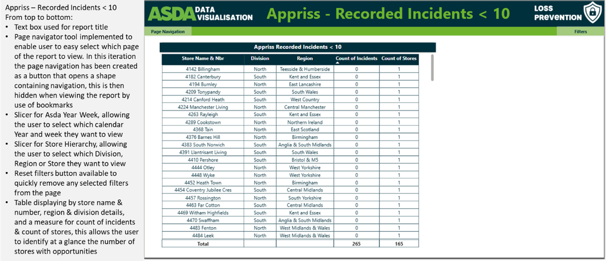
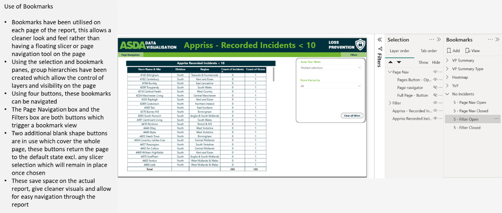

# Impact Evaluation: Appriss Dashboard Creation (2024)
This impact evaluation reviews a data engineering and visualization project completed in 2024. 

## Exec Summary
The Appriss Dashboard project was an internal executive request for visibility of incidents within retail stores, this was on the backdrop of increased media reporting, for example, ‘Retail crime is “out of control” and shoplifters are carrying out increasingly brazen and violent acts of theft’ (Wilson, Cherry and Connolly, Jim, 2025). There was increasing concern within Asda that the migration away from Wal-Mart IT systems meant a loss of visibility, especially as Asda adopted a new case management system provided by Appriss© Retail which is designed to ‘make it easy to track, act, and monitor all of the fast-paced issues’ (Case Management, no date). However, there was a gap in integration that meant no dashboards or reporting had been created for business usage, the Appriss Dashboard project in 2024 was set-out to address this gap.

## Impact
The project was determined to be a success and the dashboard created is now being utilised by the business on a weekly basis, figure 40. The deployment of this report has enabled full visibility of incident data by site across the business for essential stakeholders. Prior to the release of this report, data had to be requested by site and had specific access limitations meaning that Security colleagues in the estate could view their own data, but this could not be viewed by a wider audience. To satisfy this requirement, an individual data request would have to be completed by site; a home office colleague would then access the Appriss© systems, locate and export the requested data; and collate a manual report with interpretations of the data. The facility to scale this data up was limited and could not be completed with any frequency due to the manual resourcing required to complete the task.

 

The report that has been created within Power BI collates weekly data provided by an automated Appriss© output, unfortunately there is not an API (application programming interface) available to access the data applications directly from source. The datasets are picked up and collated weekly by a colleague into a master csv file which is then ingested. Although the resourcing issue has not been eliminated by the introduction of the dashboard, it has been improved to the extent that the home office colleague can be repurposed to complete task that adds more value e.g., focus on investigations into malicious activity. This was previously not possible due to the requirement to respond to business requests to extract and collate incident data, now the requirement is to ensure the automated csv from Appriss© is saved down in the specific location to be picked up by the report refresh. This is substantial in terms of the time saved from workload and efficiency.

## ETL Pipeline 
Once the data is picked up from the sharepoint through Microsoft Power Query, there are several minor transformations completed which enable more efficient usage e.g., unused column removal, updates to column type, and renaming of columns, figure 2. A health check of the data is completed using the view toolbar and column quality, distribution, and profile tools. The primary purpose of this is to ensure that all ‘Incident#’ rows contain a unique non-null value.

 

Minimal data cleaning is required due to working closely with Appriss© throughout data production. There are two visual level filters applied on all pages to maintain reporting accuracy, figure 3, and nine DAX measures were created to deliver the project, figure 4.

 

 

The ETL pipeline, figure 5, illustrates the architecture in use for this report. The pipeline interacts with three primary data sources, the company sharepoint where data is held, relational databases used widely in the company e.g., store data, and the flat file received and collated direct from Appriss©. The data is processed during the ingestion outlined in figure 2, before being stored in the localised data model currently in use, which is where the data is joined through relational tables figure 45, with an ambition of it being stored in the central data warehouse. The output is end user reporting, analytics & insights through Power BI, currently through a function workspace but with an end state of company visibility.  

 

 

## Limitations
The project encountered limitations due to the lack of an API, the csv master file must be stored in a sharepoint location. The intention was that this would then be ingested into Asda’s cloud-based DES (data eco-system) and a view would be created that could be queried directly in the DES and visualized via Power BI dashboards, figure 5. Delays have been encountered due to sharepoint integration falling under one CAD (computer-aided design) which is with Asda’s internal data governance teams for review, Asda is utilizing OneTrust to build a platform ‘that simplifies trust transformations across privacy, security, and ethics’ (About Us, no date). Data Governance teams are currently having to determine how this is employed to address sharepoint integration where there is company non-sensitive data and sensitive data. Data security is increasingly important, in light of recent news events with three major retailers (Marks & Spencer, Harrods, Co-op) being the victim of cyber-attacks, ‘Concerns are rising for businesses across the country, and retail attacks have risen sharply since the development of AI tools designed to help cybercriminals send out more frequent and sophisticated attacks’ (Jennings-Trace, Ellen, 2025). Increased risk equates to increased care taken when making decision making, ‘but there is no compelling one-size-fits-all privacy approach’ (Stach, Christoph, Gritti, Clémentine, Bräcker, Julia, Behringer, Michael, and Mitschang, Bernhard, 2022) for how data is handled. The restriction of not being able to ingest to the core DES has meant that the data cannot yet be shared through Asda’s primary reporting suite of analytics, instead, the report is accessed via AD group access control and used by those with sufficient permissions, figure 7. The data has been incorporated into Loss Prevention data packs shared weekly to company vice presidents, figure 8.

## Conclusion
The dashboard created was deemed a success in achieving the scope of the project, although it is accepted that it is not yet at the desired end state. The data engineering completed, and visualisations created serve the purpose of allowing business users more frequent access to data and better availability. The tools created allow for local analysis by regional teams and allow for actions to be taken quickly to mitigate emerging trends. The report has been improved through peer review and feedback from the end users e.g., introduction of a table that displays stores that have recorded less than 10 incidents, figure 9. Updates to the look and feel of the report can be observed with changes to the colour scheme, updates to branding and presentation of data, this is in line with updates to wider Asda reporting and gives the reporting a more finished & polished feel. Efficiencies have been achieved within the reporting through use of bookmarks for page navigation and slicers, figure 10, these features allow for cleaner visuals and allow the user easy access to tools when required. From a personal perspective, I was recognised as colleague of the quarter within the Retail Operations function for Q1 2025, this project contributed to the outcome of that decision.

## Future Iterations
Upon resolution of the sharepoint integration security & governance decisions, there has been an ask to build a couple of iterations of this report to serve different audiences. 
1.	A retail-facing report that allows store users to validate that all known incidents have been successfully recorded via the system. Allows them to self-diagnose risk and action where appropriate.
2.	An exec summary report that displays volume of incidents, patterns, and emerging trends to enable high level decisions (current version).
3.	A home office report that allows central & field-based teams to review and analyse incident data to make decisions on performance opportunities, asset deployment, and productivity reviews. 
4.	A Vice President summary report that allows them to see how their specific divisions & regions are performing, specifically the head and the tail from a reporting perspective. 
These reports, on completion, will be hosted via different Power BI workspaces, set-up to service the required AD group users.

## Recommendations
There are further cost efficiencies to be driven from the above use cases, for example, from a productivity perspective, using report 3, you could determine how many stores have recorded less than 10 incidents in 2025 and how many hours they receive for Security. Based on estimates, there are currently 165 stores with less than 10 incidents in Q1, 2025. These stores have received approx. 73k Security hours in this period, totaling a cost of circa. £919k, this indicates a review of allocated hours would be beneficial in these stores as there’s potentially a significant annual cost saving. There has been a further ask that on completion of this project, a similar activity is completed with other 3rd party services where data is available but not via API. This would be usage of Body Worn Video equipment and News & Magazine process compliance and loss. 

## Bibliography
About Us, no date. About Us [online] Available at https://www.onetrust.com/about-us/#accordion-5a3bb5cebe-accordionitem_1 [Accessed 24th April 2025]
Case Management, no date. Incidents. [online] Available at https://apprissretail.com/solutions/incident/ [Accessed 24th April 2025]
Jennings-Trace, Ellen, 2025. Three massive UK retailers have been hit by cyber attacks this week – so what's going on? [online] Available at https://www.techradar.com/pro/security/three-massive-uk-retailers-have-been-hit-by-cyber-attacks-this-week-so-whats-going-on [Accessed 6th May 2025] 
Stach, Christoph, Gritti, Clémentine, Bräcker, Julia, Behringer, Michael, and Mitschang, Bernhard, 2022. Protecting Sensitive Data in the Information Age: State of the Art and Future Prospects, Future Internet, Nov2022, Available through: Complementary Index [Accessed 24th April 2025]
Wilson, Cherry, and Connolly, Jim, 2025. Shoplifters 'out of control' and becoming more brazen, say retailers [online] Available at https://www.bbc.co.uk/news/articles/cp82jvd3g54o [Accessed 24th April 2025]
